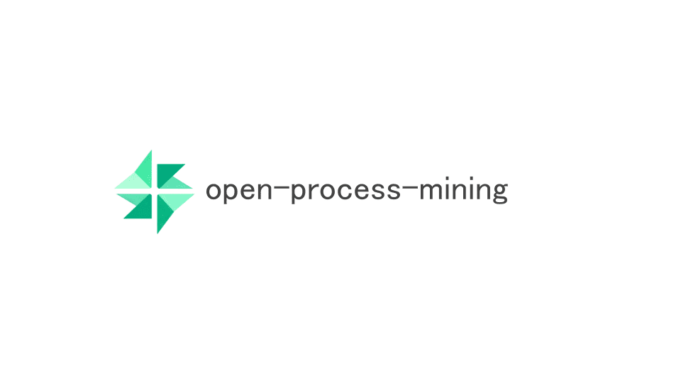
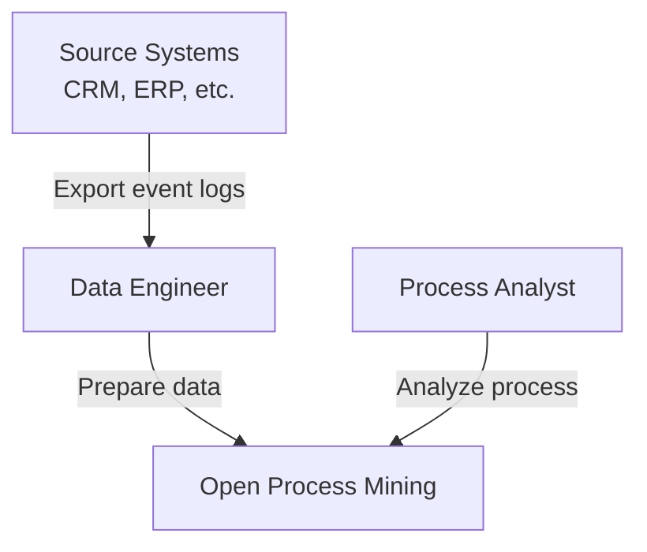
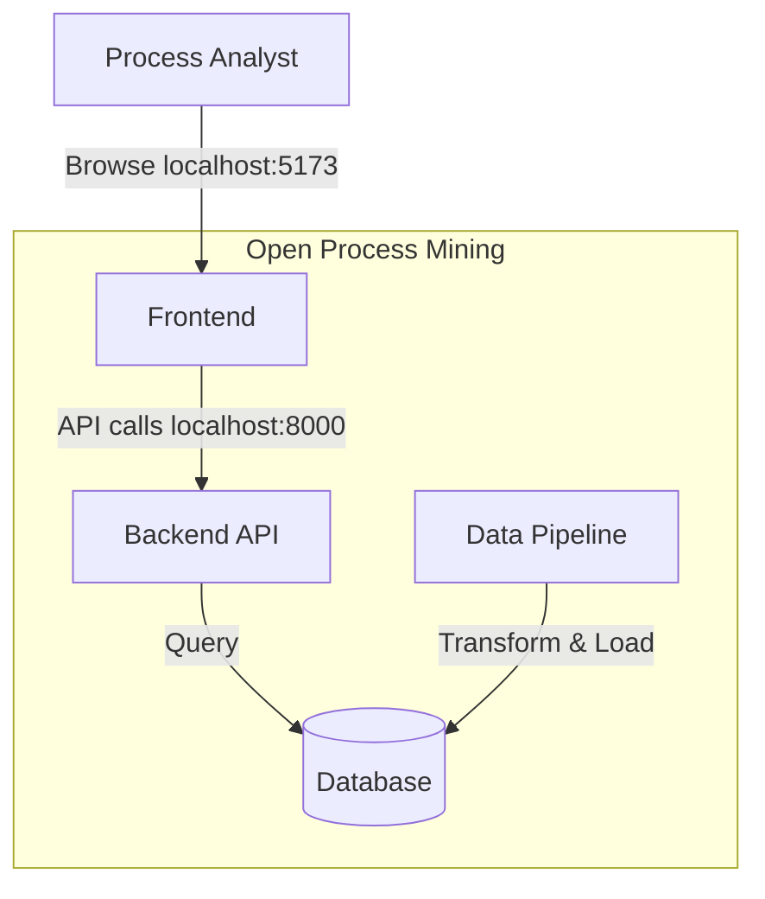

# open-process-mining

オープンソースのプロセスマイニングプラットフォーム  
データ準備から分析、可視化までの一貫したワークフローを提供します。



## 概要

**open-process-mining** は、データエンジニアとプロセスアナリストの関心事を分離し、それぞれに最適化されたツールを提供するプロセスマイニングプラットフォームです。

### 主な特徴

- **データ加工**: dbt Coreによる再現可能なデータパイプライン
- **分析エンジン**: DFG (Directly-Follows Graph) ベースのプロセス発見
- **インタラクティブな可視化**: React FlowとChakra UIによるリッチなWeb UI
  - ドラッグ&ドロップでノードを自由に配置
  - 頻度の高いパスは太い青線で表示（ハッピーパス）
  - 処理時間が長いパスは赤線で警告表示
  - パスフィルター機能で重要なフローに集中
  - メトリクス切り替え時もレイアウトを維持
- **日本語対応**: プロセス名、分析名の完全日本語化
- **MIT License**: 商用利用も含めた自由な利用が可能

## アーキテクチャ

### システムコンテキスト図



| 名前                | 説明                                                       |
| ------------------- | ---------------------------------------------------------- |
| Data Engineer       | dbtでイベントログデータを準備する担当者                    |
| Process Analyst     | Web UIでプロセス分析を実施する担当者                       |
| Open Process Mining | プロセスマイニングプラットフォーム                         |
| Source Systems      | イベントログのソースシステム（CRM、ERP、基幹システムなど） |

### コンテナ図



| 名前          | 説明                                                                                                                                                                  |
| ------------- | --------------------------------------------------------------------------------------------------------------------------------------------------------------------- |
| Frontend      | React + TypeScript製のSPA。プロセスマップ、組織分析、成果分析を可視化                                                                                                 |
| Backend API   | FastAPI製のREST API。分析結果の作成・取得、組織分析、成果分析のエンドポイントを提供                                                                                   |
| Database      | PostgreSQL。イベントログ、分析結果、マスターデータを格納                                                                                                              |
| Data Pipeline | dbt Core。ソースシステムから収集したデータをイベントログテーブルに変換するデータパイプライン<br/>※サンプルとして、収集後の想定データをCSVで取り込むようにしています。 |

### 技術スタック

- **データ加工**: dbt Core, PostgreSQL
- **バックエンド**: Python 3.11, FastAPI, Pandas, NetworkX
- **フロントエンド**: React, TypeScript, Vite, Chakra UI, React Flow
- **インフラ**: Docker Compose

## クイックスタート

```bash
git clone https://github.com/suwa-sh/open-process-mining.git
cd open-process-mining
cp .env.example .env
python scripts/generate_sample_data.py
docker compose up -d
docker compose exec backend bash -c "cd /app/dbt && dbt deps && dbt seed && dbt run"
```

ブラウザで <http://localhost:5173> を開き、Web UIから分析を作成してください。

**詳細な手順、カスタマイズ方法、トラブルシューティングは [USAGE.md](USAGE.md) を参照してください。**

### 主要な画面

- **プロセス分析一覧** (`/`): 作成したプロセス分析の一覧を表示
- **プロセスマップ** (`/process/{id}`): DFGベースのプロセスフロー可視化
- **組織分析一覧** (`/organization`): 組織分析結果の一覧を表示
- **組織分析詳細** (`/organization/{id}`): ハンドオーバー・作業負荷・パフォーマンス分析
- **成果分析一覧** (`/outcome`): 成果分析結果の一覧を表示
- **成果分析詳細** (`/outcome/{id}`): パス別成果分析・セグメント比較

## 主要機能

### プロセスマップの可視化


- **ノードのドラッグ&ドロップ**: ノードを自由に配置して見やすいレイアウトを作成
- **パスの強調表示**:
  - 🔵 **青色の太い線**: 頻度が高いハッピーパス（最大頻度の80%以上）
  - 🔴 **赤色の線**: 処理時間が長い問題のあるパス（最大待機時間の70%以上）
- **パスフィルター**: スライダーで低頻度のパスを非表示にして重要なフローに集中
- **メトリクス切り替え**: 頻度と平均待機時間を切り替えて分析
- **レイアウト保持**: メトリクス切り替え時もドラッグした配置を維持
- **複数プロセス対応**: 異なるビジネスプロセスを同一システムで管理・分析

### 組織分析（ハンドオーバー・作業負荷・パフォーマンス）

- **🔄 ハンドオーバー分析**: 誰と誰が連携して作業しているかを可視化
  - 
    - 社員別・部署別の集計レベルを選択可能
    - ハンドオーバー間の平均待機時間を計算
    - 頻度と待機時間のメトリクス切り替え
    - パスフィルターで重要な連携に集中
- **📊 作業負荷分析**: 誰の作業量が多いかを可視化
  - 
    - アクティビティ数とケース数の集計
    - 作業が集中している担当者を特定
- **⏱️ パフォーマンス分析**: 誰の処理時間が長いかを可視化
  - 
    - 平均処理時間・中央値・合計時間を分析
    - ボトルネックになっている担当者を特定

### 成果分析（パス別成果・セグメント比較）

- **📈 パス別成果分析**: プロセスパスごとの成果指標を可視化
  - 
    - 各パスの平均値・中央値・合計値を表示
    - 成果の高いパスを自動検出（平均値の75%以上を強調表示）
    - プロセスマップ上で成果メトリックを確認
- **🔍 セグメント比較**: 高成果パスと低成果パスを比較
  - 
    - 上位25% vs 下位25%の成果比較
    - カスタム閾値による柔軟なセグメント分割
    - 統計サマリー（平均値、中央値、最小値、最大値、合計値）
    - パス構造の違いを可視化

## サンプルデータ

プロジェクトには2024年1年分の6種類のビジネスプロセスデータが含まれています。

- [SAMPLE_DATA.md](./SAMPLE_DATA.md)

## 開発ワークフロー

### データエンジニア向け

#### 新しいデータソースの追加

1. `dbt/seeds/` にCSVファイルを配置
2. `dbt/models/staging/` でステージングモデルを作成
3. `dbt/models/staging/stg_all_events.sql` に UNION ALL で追加

```bash
# dbtでデータ投入
dbt seed
dbt run
dbt test
```

#### 分析の実行

分析はWeb UI (<http://localhost:5173>) から実行します：

1. **プロセス分析**: トップ画面から「新規作成」→ プロセスタイプを選択 → 「作成」
2. **組織分析**: 「組織分析」タブから「新規作成」→ プロセスタイプを選択 → 「作成」
3. **成果分析**: 「成果分析」タブから「新規作成」→ プロセスタイプとメトリックを選択 → 「作成」

詳細は [USAGE.md](USAGE.md) を参照してください。

### バックエンド開発者向け

#### コード品質チェック

プロジェクトでは[qlty](https://qlty.sh)を使用して、複数のlinterとformatterを統合管理しています。

```bash
# フォーマット実行
make fmt

# すべてのlinterを実行（qlty check + sqlfluff）
make lint

# 個別にqltyを実行する場合
qlty check                          # すべてのlinter/formatterを実行
qlty fmt                            # 自動修正可能な問題を修正
qlty check backend/src/main.py     # 特定のファイルのみチェック
```

**有効化されているツール:**

- **Python**: ruff (linter), black (formatter), bandit (security)
- **TypeScript/JavaScript**: prettier (formatter), radarlint (静的解析)
- **Dockerfile**: hadolint (linter), dockerfmt (formatter), checkov (security)
- **YAML**: yamllint
- **Markdown**: markdownlint
- **SQL**: sqlfluff（`make lint`に含まれる）

**SQLファイルのlint（個別実行する場合）:**

```bash
# backend/sql/以下のSQLファイル
~/.qlty/cache/tools/sqlfluff/3.4.0-f921ba7a9b1c/bin/sqlfluff lint backend/sql/ --dialect postgres

# dbt models
~/.qlty/cache/tools/sqlfluff/3.4.0-f921ba7a9b1c/bin/sqlfluff lint dbt/models/ --dialect postgres --config .sqlfluff

# 自動修正
~/.qlty/cache/tools/sqlfluff/3.4.0-f921ba7a9b1c/bin/sqlfluff fix <file> --dialect postgres
```

#### テストの実行

```bash
# すべてのテスト（backend + E2E）
make test-all

# バックエンドテストのみ
make test

# E2Eテストのみ
make test-e2e

# 個別にテストを実行する場合
docker compose exec backend pytest tests/    # バックエンドテスト
cd e2e && npm test                            # E2Eテスト
```

#### API仕様

FastAPIが自動生成するOpenAPI（Swagger UI）ドキュメントで全エンドポイントを確認できます：

- **Swagger UI**: <http://localhost:8000/docs>
- **ReDoc**: <http://localhost:8000/redoc>
- **OpenAPI JSON**: <http://localhost:8000/openapi.json>

**主要API**:

- `/health`: ヘルスチェック
- `/process/*`: プロセス分析API
- `/organization/*`: 組織分析API
- `/outcome/*`: 成果分析API

### フロントエンド開発者向け

#### コード品質チェック

フロントエンドもqltyでlint/formatを実行できます：

```bash
# フォーマット実行
make fmt

# すべてのlinterを実行
make lint

# 個別にqltyを実行する場合
qlty check frontend/src/          # フロントエンドファイルのチェック
qlty fmt frontend/src/            # 自動修正
qlty check frontend/src/App.tsx   # 特定のファイルのみ
```

**フロントエンドで有効なツール:**

- **prettier**: コードフォーマッター（TypeScript, TSX, CSS, JSON）
- **radarlint**: TypeScript静的解析（複雑度、コード品質）
- **markdownlint**: Markdownファイルの検証

#### 開発サーバー

フロントエンドは自動でホットリロードされます。

```bash
# フロントエンドコンテナ内
cd /app
npm run dev
```

### E2Eテスト（Playwright）

E2Eテストは、実際のブラウザを使ってアプリケーション全体の動作を検証します。

```bash
# E2Eテストを実行
make test-e2e

# または個別に実行
cd e2e && npm test
```

**初回セットアップ**（初回のみ）:

```bash
cd e2e
npm install
npx playwright install chromium
```

**テスト内容**:

- プロセス分析（一覧、作成、マップ表示）
- 組織分析（一覧、作成、集計レベル切り替え）
- 成果分析（一覧、パス別成果、セグメント比較）

詳細は [e2e/README.md](e2e/README.md) を参照してください。

## データベース接続

### PostgreSQLデータの保存場所

- **Dockerボリューム**: `postgres-data`（Named Volume、Dockerが自動管理）
- **データベース名**: `process_mining_db`
- **ポート**: `localhost:5432`
- **ユーザー名**: `process_mining`（`.env`で設定）
- **パスワード**: `secure_password`（`.env`で設定）

### 主要テーブル

| テーブル                        | 説明                                             |
| ------------------------------- | ------------------------------------------------ |
| `fct_event_log`                 | プロセスマイニング用イベントログ（組織情報含む） |
| `fct_case_outcomes`             | ケース別成果データ（メトリック値）               |
| `process_analysis_results`      | プロセス分析結果（JSON形式）                     |
| `organization_analysis_results` | 組織分析結果（JSON形式）                         |
| `outcome_analysis_results`      | 成果分析結果（JSON形式）                         |
| `master_employees`              | 社員マスター                                     |
| `master_departments`            | 部署マスター                                     |

詳細なスキーマ情報とデータベース操作は [USAGE.md](USAGE.md) を参照してください。

### 接続方法

**コンテナ内でpsqlを使用**（推奨）:

```bash
docker compose exec postgres psql -U process_mining -d process_mining_db
```

**GUIツールで接続**（TablePlus、DBeaver、pgAdminなど）:

- Host: `localhost`
- Port: `5432`
- Database: `process_mining_db`
- User: `process_mining`
- Password: `secure_password`

**よく使うSQL**:

```sql
-- イベントログ件数
SELECT process_type, COUNT(*) FROM fct_event_log GROUP BY process_type;

-- 分析結果一覧
SELECT analysis_id, analysis_name, created_at FROM process_analysis_results;
```

## ドキュメント

- **[USAGE.md](USAGE.md)**: 自組織でプロセスマイニングを実施する方法（利用者向け）
- **[CLAUDE.md](CLAUDE.md)**: 開発ガイド（開発者向け）

## ライセンス

MIT License - 詳細は [LICENSE](LICENSE) を参照

## コントリビューション

Issue、Pull Requestを歓迎します。

## 参考資料

- [dbt documentation](https://docs.getdbt.com/)
- [FastAPI documentation](https://fastapi.tiangolo.com/)
- [React Flow documentation](https://reactflow.dev/)
- [Chakra UI documentation](https://chakra-ui.com/)
